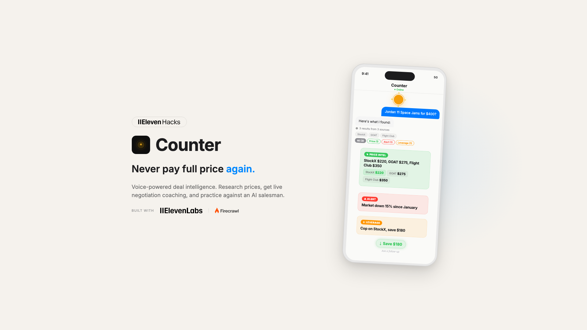

# Counter



Real-time deal intelligence powered by ElevenLabs agents and Firecrawl search. Stop overpaying, start negotiating.

`ElevenLabs` · `Firecrawl` · `Convex` · `Better Auth` · `Expo SDK 56 (canary)` · `React Native 0.84` · `React 19` · `Bun`

## ElevenHacks Season 1

My submission for the [ElevenHacks](https://elevenlabs.io/elevenhacks) hackathon, a collaboration between [ElevenLabs](https://elevenlabs.io) and [Firecrawl](https://firecrawl.dev).

- [Video Demo](https://x.com/ramonclaudio/status/2037188827782013018)
- [LinkedIn Post](https://www.linkedin.com/posts/ramonclaudio_elevenhacks-ugcPost-7442954144543301633-Qaiw)

## What It Does

Whether you're checking prices before you buy, practicing for a negotiation, or need real-time coaching while you're in one, Counter has your back.

**Research** - Ask about any product. Counter searches the web and drops intel cards with prices, market sentiment, scam warnings, and where to buy. You talk, it searches. Cards show up as results come back.

**Live** - Keep Counter in your ear during the actual negotiation. It listens to what the other side says and whispers coaching back. Invoice prices, counter offers, when to hold, when to walk.

**Practice** - A tough AI salesman that throws real tactics at you: anchoring, urgency, good cop/bad cop. It scores your technique and tells you what to fix. Run the raise conversation, the car deal, the lease renewal.

## How It Uses ElevenLabs + Firecrawl

**ElevenLabs Conversational AI** runs the voice agent. Connects via WebRTC through `@elevenlabs/react-native`. Each mode has its own personality and system prompt. Live mode whispers. Practice mode plays a salesman. Research mode is a calm analyst. The agent calls custom tools (`updateIntelCards`, `skipTurn`) to push structured data back to the client as it talks.

**Firecrawl** runs the web search. You ask about a product, Counter fires queries through Firecrawl's API on the Convex backend, processes results, and feeds them back to the ElevenLabs agent as tool context. The agent reads the results and pushes intel cards to the feed.

## Architecture

| Layer | Tech |
| :--- | :--- |
| Package Manager | Bun |
| Framework | Expo SDK 56 (canary) · React Native 0.84 · React 19 |
| Backend | Convex (real-time queries, mutations, actions, crons) |
| Auth | Better Auth via `@convex-dev/better-auth` |
| Voice AI | ElevenLabs Conversational AI via `@elevenlabs/react-native` |
| WebRTC | LiveKit (`@livekit/react-native`) |
| Web Search | Firecrawl API (Convex actions) |
| Email | Resend via `@convex-dev/resend` |
| UI | `@expo/ui` (Swift UI) · SF Symbols · Haptics |
| Styling | React Native StyleSheet · `DynamicColorIOS` |
| Animation | React Native Reanimated 4 |
| Lists | `@shopify/flash-list` |

## Intel Cards

Four types, color-coded:

| Type | Color | What It Shows |
| :--- | :--- | :--- |
| Price Intel | Green | Prices across retailers/platforms with best price highlighted |
| Alert | Red | Scam warnings, bad reviews, overpriced flags |
| Alternative | Teal | Cheaper or better options you didn't know about |
| Leverage | Orange | Negotiation ammo: invoice prices, incentives, market data |

Each card shows the source, a favicon chip, and a savings pill when Counter finds a better price.

---

<details>

<summary><strong>Setup & Development</strong></summary>

### Prerequisites

| Service | Purpose | Sign Up |
| :--- | :--- | :--- |
| [Convex](https://convex.dev) | Real-time backend | Free tier available |
| [ElevenLabs](https://elevenlabs.io) | Voice AI agent | Free tier available |
| [Firecrawl](https://firecrawl.dev) | Web search API | Free tier available |
| [Resend](https://resend.com) | Transactional email | Free tier (3k/month) |
| [Expo](https://expo.dev) | Build service | Free tier available |

**Local requirements:** Bun, Xcode 16+

> [!IMPORTANT]
> Expo Go is not supported. SDK 56 requires development builds. Use `expo start --dev-client`.

### Quick Start

**1. Clone & Install**

```bash
git clone https://github.com/ramonclaudio/counter.git
cd counter
bun install
```

**2. Create Convex Deployment**

```bash
bunx convex dev
```

Follow the prompts. First push will fail until env vars are set.

**3. Set Environment Variables**

```bash
bunx convex env set BETTER_AUTH_SECRET=$(openssl rand -base64 32)
bunx convex env set ELEVENLABS_API_KEY=sk_xxxxxxxxxxxx
bunx convex env set ELEVENLABS_AGENT_ID=agent_xxxxxxxxxxxx
bunx convex env set FIRECRAWL_API_KEY=fc-xxxxxxxxxxxx
bunx convex env set RESEND_API_KEY=re_xxxxxxxxxxxx
bunx convex env set RESEND_FROM_EMAIL=noreply@yourdomain.com
bunx convex env set SITE_URL=counter://
```

Add to `.env.local`:

```bash
EXPO_PUBLIC_ELEVENLABS_AGENT_ID=agent_xxxxxxxxxxxx
```

Re-run `bunx convex dev`. It will push successfully.

**4. Run**

**Terminal 1 (Backend):**

```bash
bun run convex:dev
```

**Terminal 2 (App):**

```bash
bun run ios
```

</details>

<details>

<summary><strong>Commands</strong></summary>

```bash
# Development
bun run ios                 # Build + simulator
bun run ios:device          # Build + physical device
bun run convex:dev          # Convex backend with hot reload

# Quality
bun run typecheck           # tsc --noEmit
```

</details>

<details>

<summary><strong>Troubleshooting</strong></summary>

| Problem | Solution |
| :--- | :--- |
| First `convex dev` fails | Expected. Set env vars per step 3, then re-run |
| Voice not connecting | Check `ELEVENLABS_API_KEY` and `ELEVENLABS_AGENT_ID` |
| Search not returning results | Check `FIRECRAWL_API_KEY` in Convex env |
| Push notifications fail | Use physical device (simulator doesn't support) |
| Expo Go crashes | Use `expo start --dev-client` instead |

</details>

---

## License

MIT
